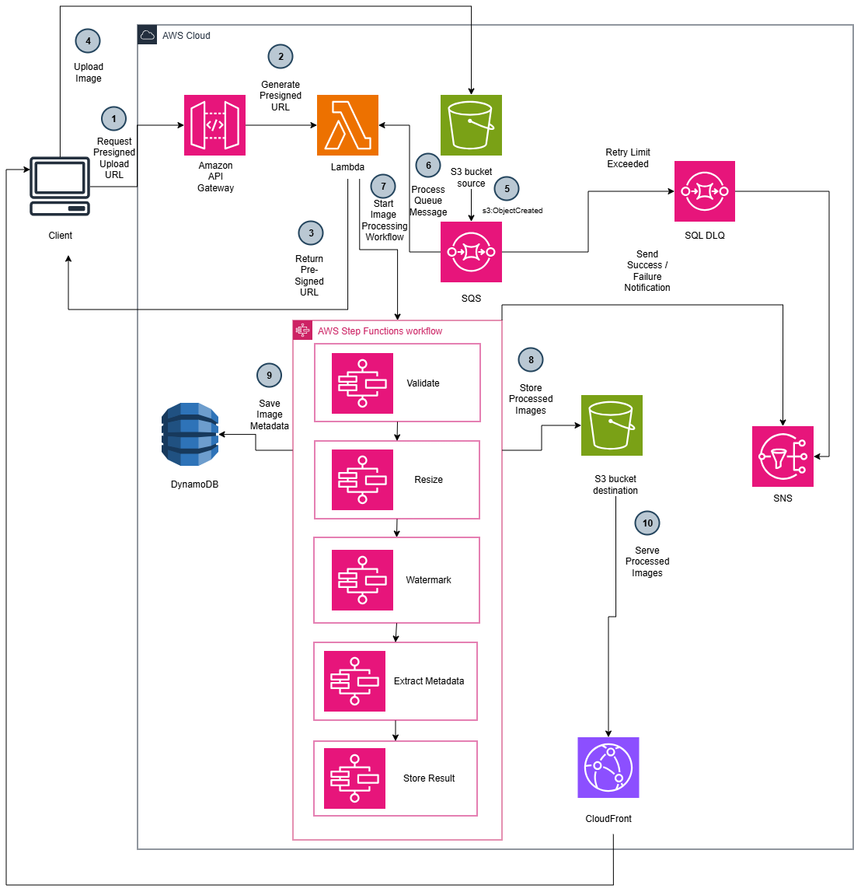

# Serverless Automated Image Processing Pipeline

An end-to-end serverless architecture built on AWS that automates image upload, validation, asynchronous processing (resizing and watermarking), metadata extraction, and global CDN delivery.

---

## 🏗️ Architecture Overview



The system processes images through an asynchronous event-driven workflow:

1. **Client Request:** The client sends a `GET /uploads` request to **Amazon API Gateway**.
2. **Presigned URL Generation:** API Gateway triggers the `Img-PresignedUrl` **AWS Lambda** function to generate and return a secure Amazon S3 presigned URL.
3. **Direct S3 Upload:** The client directly uploads the raw image to the **Source S3 Bucket** via the presigned URL.
4. **Event Notification & Queueing:** An `s3:ObjectCreated` event sends a notification to an **Amazon SQS** queue to decouple storage and processing.
5. **Workflow Orchestration:** SQS triggers the **AWS Step Functions** workflow, which sequentially executes:
   * **`Img-Validate`**: Verifies file extension and payload structure.
   * **`Img-ResizeAndWatermark`**: Resizes the image and applies a watermark using a custom Lambda Layer (Pillow), storing the final asset in the **Destination S3 Bucket**.
   * **`Img-ExtractAndSaveMetadata`**: Extracts image dimensions, format, and timestamp, saving the record to **Amazon DynamoDB**.
6. **Error Handling:** If any step fails, Step Functions catches the error and triggers **Amazon SNS** to send an email notification.
7. **Content Delivery:** Processed images are securely cached and served to clients globally via **Amazon CloudFront** using Origin Access Control (OAC).

---

## 🛠️ AWS Services & Tech Stack

* **API & Compute:** Amazon API Gateway, AWS Lambda (Python 3.x), AWS Lambda Layers (Pillow)
* **Storage & Caching:** Amazon S3 (Source & Destination Buckets), Amazon CloudFront (CDN with OAC)
* **Orchestration & Integration:** AWS Step Functions (ASL), Amazon SQS, Amazon SNS
* **Database:** Amazon DynamoDB

---

## 📁 Repository Structure

```text
.
├── src/
│   ├── presigned_url.py         # Lambda: Generates S3 presigned upload URL
│   ├── validate_image.py        # Lambda: Validates file type and object key
│   ├── resize_watermark.py      # Lambda: Resizes image and applies watermark
│   └── extract_metadata.py      # Lambda: Saves image metadata to DynamoDB
├── step-functions/
│   └── workflow.json            # Step Functions Amazon States Language (ASL) definition
├── serverless-diagram.drawio.png # Architecture diagram image
├── .gitignore
└── README.md                    # Project documentation
